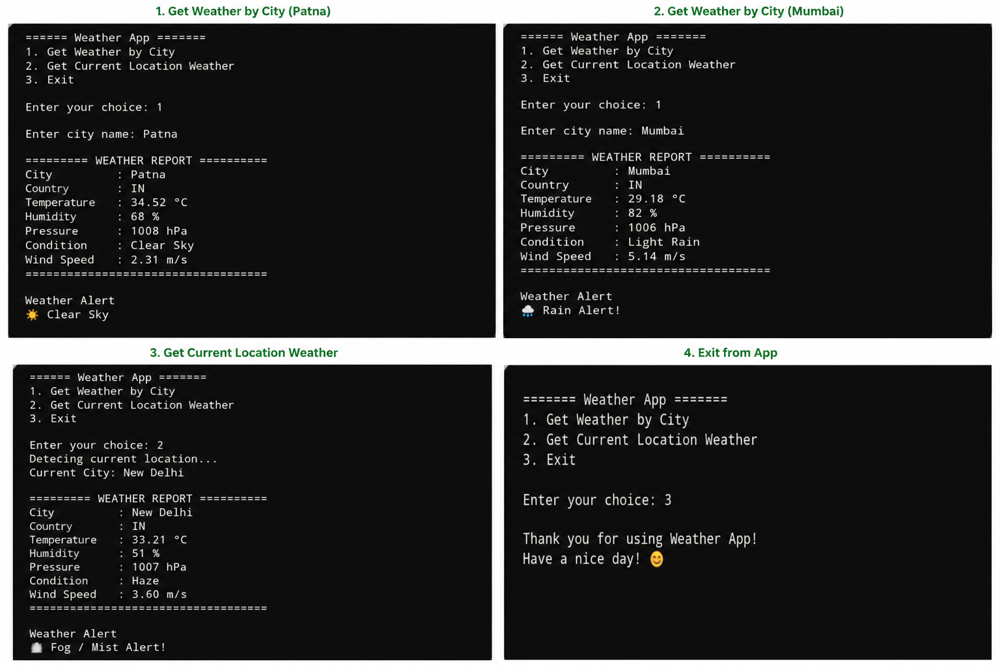

🌦️ Weather App

A simple Python-based Weather Application that fetches real-time weather information using the OpenWeatherMap API. Users can check the weather by entering a city name or by using their current location (detected via IP address).

---

✨ Features

- Check weather by city name
- Detect current location automatically
- Display temperature in Celsius
- Display humidity
- Display wind speed
- Show weather condition
- 🚨 Weather alerts for:
  - Thunderstorms
  - Drizzle
  - Rain
  - Snow
  - Fog / Mist
  - Clear Sky
  - Cloudy Weather

---

🛠️ Technologies Used

- Python 3
- Requests Library
- Geocoder Library
- OpenWeatherMap API

---

📦 Installation

Clone the repository

git clone https://github.com/archit-dot/Weather_Status.git
cd Weather_Status

Install the required libraries

pip install -r requirements.txt

---

🔑 API Key Setup

1. Create a free account at https://openweathermap.org/
2. Generate an API key.
3. Open "weather.py".
4. Replace:

API_KEY = "YOUR_API_KEY"

with your own API key.

---

▶️ Run the Program

weather.py

---

📷 Sample Output

---

Requirements

requests
geocoder

---

 Future Improvements

- 5-Day Weather Forecast
- Air Quality Index (AQI)
- Weather Icons
- Graphical User Interface (GUI)
- Save Search History
- Voice-Based Weather Search

---

👨‍💻 Author

Archit

GitHub: https://github.com/archit-dot

---

⭐ If you found this project useful, consider giving it a Star on GitHub!
